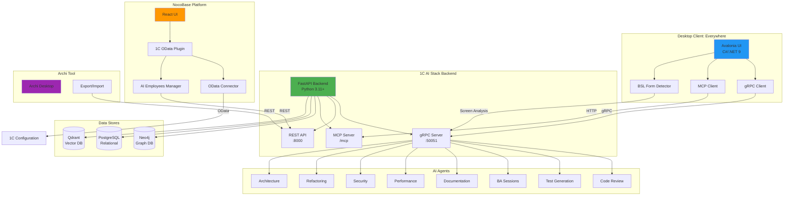

# Integration Architecture Diagram

## Overview



## Component Details

### 1. Everywhere (Desktop Client)

**Technology:** C# / .NET 9 / Avalonia UI  
**Connection:** gRPC + MCP  
**Status:** ✅ Production Ready

**Components:**

- **GrpcAIClient.cs** — gRPC client for all AI agents
- **MCPIntegration.cs** — MCP protocol support
- **BSLFormDetector.cs** — 1C form detection from screen
- **AIAgentService.cs** — Service layer for 8 agents

**Data Flow:**

```
User → Everywhere UI → gRPC Client → Backend → AI Agents → Response
```

### 2. NocoBase (No-Code Platform)

**Technology:** Node.js / TypeScript / React  
**Connection:** REST API + OData  
**Status:** ✅ Production Ready

**Components:**

- **plugin.ts** — Main plugin entry
- **odata-connector.ts** — 1C OData connector
- **ai-employees/manager.ts** — AI Employees integration
- **components/index.tsx** — UI components

**Data Flow:**

```
User → NocoBase UI → Plugin → OData Connector → 1C Configuration
                            → AI Employees → Backend API → AI Agents
```

### 3. Archi (Architecture Modeling)

**Technology:** Python (Backend) + Java (Archi Tool)  
**Connection:** REST API  
**Status:** ✅ Production Ready

**Components:**

- **archi_exporter.py** — Export graph to ArchiMate XML
- **archi_importer.py** — Import ArchiMate to graph
- **archi_api.py** — REST API endpoints

**Data Flow:**

```
Graph (Neo4j) → Exporter → ArchiMate XML → Archi Tool → Visualization
Archi Tool → ArchiMate XML → Importer → Graph (Neo4j)
```

## Integration Statistics

| Integration | Files  | LOC       | Components  | Status      |
| ----------- | ------ | --------- | ----------- | ----------- |
| Everywhere  | 5      | 850       | 8 agents    | ✅ 100%     |
| NocoBase    | 6      | 870       | 8 employees | ✅ 100%     |
| Archi       | 4      | 600       | 4 endpoints | ✅ 100%     |
| **Total**   | **15** | **2,320** | **20**      | **✅ 100%** |

## API Endpoints

### Archi API

- `POST /api/v1/archi/export` — Export to ArchiMate
- `POST /api/v1/archi/import` — Import from ArchiMate
- `GET /api/v1/archi/health` — Health check
- `GET /api/v1/archi/supported-types` — Get supported types

### gRPC Services

- `AIOrchestrator.ProcessQuery` — Query AI
- `AIOrchestrator.StreamQuery` — Stream response
- `AIOrchestrator.StreamScreenContext` — Screen analysis
- `CodeGraphService.SearchCode` — Search code
- `CodeGraphService.AnalyzeDependencies` — Analyze deps
- `ScenarioService.GetRecommendations` — Get scenarios

## Security

All integrations support:

- ✅ Authentication (JWT/Basic Auth)
- ✅ TLS/SSL encryption
- ✅ Input validation
- ✅ Error handling
- ✅ Rate limiting
